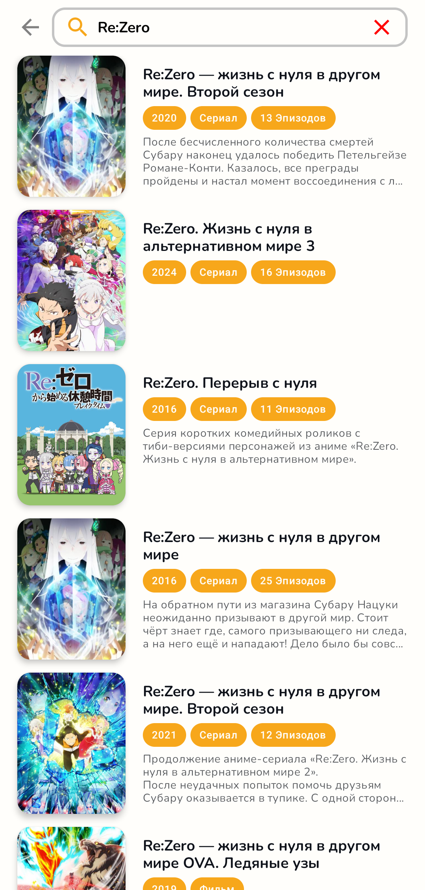
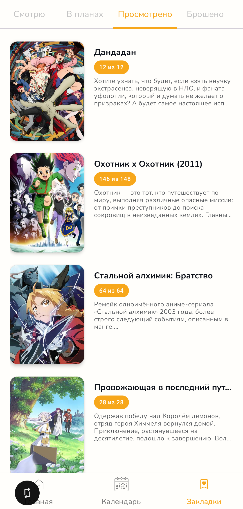
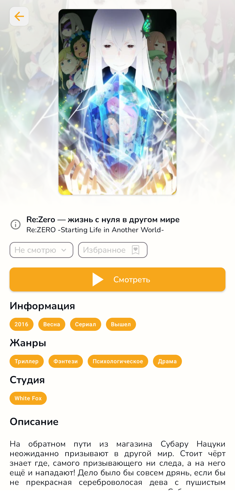

# Anifox

Anifox is a mobile application for anime streaming, offering users access to a large catalog of
anime with features like search, favorites, and notifications for new episodes. This repository
hosts the **Android version** of Anifox, while other versions and information about the project can
be found on our official website: [anifox.club](https://anifox.club) or on
our [github](https://github.com/ANIFOX-CLUB)

## 🔖 Releases

Download the app on github releases or in RuStore.

## 📱 Features

- Stream popular anime series and movies
- Browse a comprehensive catalog with details on each anime (description, genres, episode count)
- Search the anime catalog by title, genre, studio, release year, type, status, translation and
  season
- Add anime to favorites for quick access
- Most screens are adapted for small as well as large devices

## ✨ Future Improvements

- User experience
- User Profile
- User registration
- User login
- Player

## Requirements

- **Minimum Android Version**: 8.0 (Oreo)

## 📸 Screenshots

<table>
  <tr>
    <td></td>
    <td></td>
    <td></td>
    <td></td>
    <td></td>
  <tr>
  <tr>
    <td></td>
    <td></td>
    <td></td>
    <td></td>
    <td></td>
  </tr>
</table>

## 🛠️ Contents & Libraries

- MVVM
- Modularization & Multi Module App Architecture
- Clean Architecture
- Jetpack Compose
- Hilt
- Ktor Client
- Coroutines
- DataStore
- Shimmer
- Centralize Dependencies ( With Version Catalogs )
- Lint
- Paging
- Room
- Kotlinx Serialization
- Material3
- Coil

## 🤝 Contributing

I welcome contributions to Anifox! To contribute, please follow these steps:

1. Fork this repository.
2. Create a feature branch (`git checkout -b feature/AmazingFeature`).
3. Commit your changes (`git commit -m 'Add some AmazingFeature'`).
4. Push to the branch (`git push origin feature/AmazingFeature`).
5. Open a Pull Request.

## 📄 License

This project is licensed under the [Apache License 2.0](LICENSE).

## 📫 Contact

For any questions or suggestions, feel free to reach out via email at **denis.akhunov123@gmail.com**
or open an Issue in this repository.

Thank you for using Anifox! I hope you enjoy the app 🦊😊
